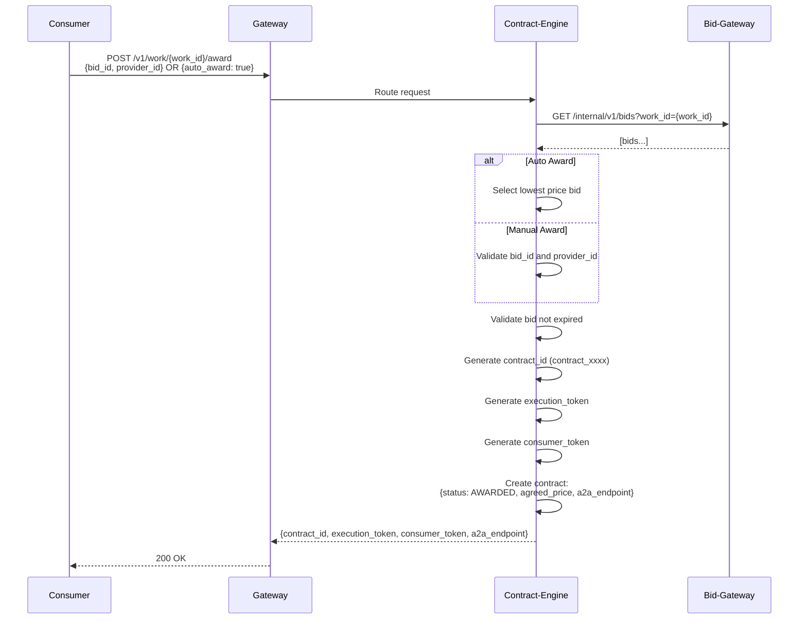

# Agent Exchange - System Flow Diagrams (Mermaid)

This document contains Mermaid diagrams explaining how the Agent Exchange platform works.

## Table of Contents

1. [System Overview](#1-system-overview)
2. [Work Submission Flow](#2-work-submission-flow)
3. [Provider Registration Flow](#3-provider-registration-flow)
4. [Bid Submission Flow](#4-bid-submission-flow)
5. [Bid Evaluation Flow](#5-bid-evaluation-flow)
6. [Contract Award Flow](#6-contract-award-flow)
7. [Contract Execution Flow](#7-contract-execution-flow)
8. [Settlement Flow](#8-settlement-flow)
9. [Trust Score Update Flow](#9-trust-score-update-flow)
10. [Complete End-to-End Flow](#10-complete-end-to-end-flow)

---

## 1. System Overview

### High-Level Architecture


### Service Communication Map


---

## 2. Work Submission Flow


### Work State Machine


---

## 3. Provider Registration Flow


### Provider Trust Tiers


---

## 4. Bid Submission Flow


### Bid Packet Structure


---

## 5. Bid Evaluation Flow


### Scoring Algorithm


---

## 6. Contract Award Flow



### Contract State Machine


---

## 7. Contract Execution Flow


---

## 8. Settlement Flow


### Cost Breakdown


### Ledger Entry Flow


---

## 9. Trust Score Update Flow


### Trust Score Calculation


---

## 10. Complete End-to-End Flow


### System State After Completion


---

## Event Flow

```mermaid
flowchart LR
    subgraph Events
        E1[work.submitted]
        E2[work.bid_window_closed]
        E3[contract.awarded]
        E4[contract.completed]
        E5[settlement.completed]
    end

    subgraph Triggers
        T1[Provider notification]
        T2[Bid evaluation]
        T3[Provider notification]
        T4[Settlement process]
        T5[Trust update]
    end

    E1 --> T1
    E2 --> T2
    E3 --> T3
    E4 --> T4
    E5 --> T5
```

---

## Service Dependencies

```mermaid
flowchart TB
    subgraph Tier 1 - Entry Points
        GW[Gateway]
    end

    subgraph Tier 2 - Core Business
        WP[Work Publisher]
        BG[Bid Gateway]
        CE[Contract Engine]
        PR[Provider Registry]
    end

    subgraph Tier 3 - Support
        BE[Bid Evaluator]
        TB[Trust Broker]
        ST[Settlement]
    end

    subgraph Tier 4 - Infrastructure
        ID[Identity]
        TM[Telemetry]
    end

    subgraph Storage
        DB[(Database)]
    end

    GW --> WP
    GW --> BG
    GW --> CE
    GW --> PR
    GW --> ST
    GW --> ID

    WP --> PR
    WP --> DB
    BG --> PR
    BG --> DB
    CE --> BG
    CE --> ST
    CE --> DB
    PR --> DB

    BE --> BG
    BE --> TB
    TB --> DB
    ST --> TB
    ST --> DB

    ID --> DB
    TM --> DB
```

---

## API Routes Overview

```mermaid
flowchart LR
    subgraph Public APIs
        direction TB
        A1[POST /v1/work]
        A2[POST /v1/bids]
        A3[POST /v1/providers]
        A4[POST /v1/contracts/award]
        A5[GET /v1/balance]
    end

    subgraph Internal APIs
        direction TB
        B1[GET /internal/v1/bids]
        B2[POST /internal/v1/evaluate]
        B3[GET /internal/v1/providers/subscribed]
        B4[POST /internal/v1/outcomes]
        B5[GET /internal/v1/providers/validate-key]
    end

    subgraph Services
        WP[Work Publisher]
        BG[Bid Gateway]
        PR[Provider Registry]
        CE[Contract Engine]
        BE[Bid Evaluator]
        TB[Trust Broker]
        ST[Settlement]
    end

    A1 --> WP
    A2 --> BG
    A3 --> PR
    A4 --> CE
    A5 --> ST

    B1 --> BG
    B2 --> BE
    B3 --> PR
    B4 --> TB
    B5 --> PR
```


